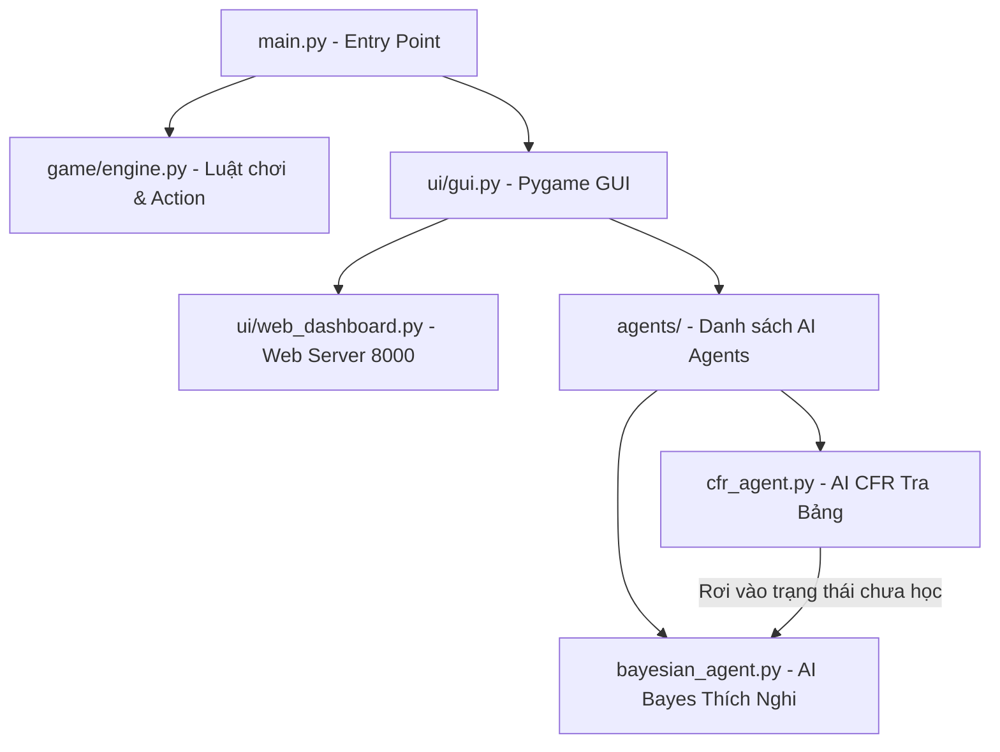

# BÁO CÁO PHÂN TÍCH DỰ ÁN & HƯỚNG DẪN THUYẾT TRÌNH BÀI TẬP LỚN
## ĐỀ TÀI: XÂY DỰNG AI CHƠI LIAR'S DICE LAI CFR VÀ SUY LUẬN BAYES THÍCH NGHI TRỰC TUYẾN

Tài liệu này được biên soạn dựa trên cấu trúc mã nguồn thực tế của dự án nhằm phục vụ việc làm **Báo cáo bài tập lớn** và chuẩn bị **Slide thuyết trình**.

---

## PHẦN I: KIẾN THỨC CỐT LÕI & LÝ THUYẾT TRÒ CHƠI (GAME THEORY)

### 1. Phân loại trò chơi Liar's Dice (Đổ xúc xắc nói dối)
* **Trò chơi thông tin không hoàn hảo (Imperfect Information Game):** Người chơi không biết các quân xúc xắc của đối thủ (bị ẩn).
* **Trò chơi tổng bằng không (Zero-sum Game):** Lợi ích của người này là thiệt hại của người kia (chỉ có 1 người thắng và 1 người mất xúc xắc).
* **Trò chơi có yếu tố ngẫu nhiên (Stochastic Game):** Sự ngẫu nhiên nằm ở bước gieo (roll) xúc xắc đầu mỗi vòng.

### 2. Thuật toán CFR (Counterfactual Regret Minimization)
* **Mục tiêu:** Tìm kiếm **Cân bằng Nash (Nash Equilibrium)**. Tại thế cân bằng này, cả hai người chơi đều chơi tối ưu đến mức không ai muốn đơn phương thay đổi chiến thuật vì nếu thay đổi sẽ chỉ có hòa hoặc thua.
* **Cơ chế hoạt động:**
  * CFR huấn luyện thông qua hàng chục ngàn vòng tự chơi (self-play).
  * Với mỗi trạng thái thông tin (Infoset), AI tính toán **Regret (Độ hối tiếc)** cho từng hành động hợp lệ (Cược/Tố cáo).
  * **Hối tiếc (Regret)** thể hiện việc: *"Lẽ ra ta sẽ thắng được bao nhiêu điểm nếu chọn hành động $A$ thay vì hành động ta đã chọn?"*
  * AI sử dụng quy tắc **Regret Matching** để tăng xác suất chọn các hành động có độ hối tiếc dương cao trong các vòng lặp tiếp theo. Qua thời gian, độ hối tiếc trung bình tiệm cận về 0, tạo ra bảng chiến lược chơi tối ưu không thể bị bắt bài.

### 3. Suy luận Bayes trực tuyến (Online Bayesian Inference)
* **Mục tiêu:** Ước lượng xác suất đối thủ đang cược láo (bluff) trong thời gian thực để đưa ra hành vi bóc lột (Exploitation).
* **Cơ chế Beta-Bernoulli Conjugate Prior (Liên hợp tiên nghiệm):**
  * Coi hành vi bluff của đối thủ là một phép thử Bernoulli với xác suất $\theta$ (bluff rate).
  * Đặt tiên nghiệm cho $\theta$ là phân phối Beta: $Beta(\alpha_0, \beta_0)$ với kỳ vọng ban đầu là $\frac{\alpha_0}{\alpha_0 + \beta_0}$ (mặc định $\alpha_0=1.0, \beta_0=2.0 \rightarrow 1/3$).
  * Khi có một mẫu dữ liệu mới được lật tẩy (sau mỗi lượt Challenge), ta cập nhật hậu nghiệm:
    $$Beta(\alpha_{new}, \beta_{new}) = Beta(\alpha_0 + k, \beta_0 + n - k)$$
    Trong đó: $n$ là số lần cược của đối thủ được kiểm chứng, $k$ là số lần đối thủ thực sự bluff (cược sai).
  * **Multi-context Bayes (Đa ngữ cảnh):** AI học thói quen bluff của bạn trong 6 ngữ cảnh cụ thể:
    1. Mặc định (General).
    2. Bạn còn ít xúc xắc ($\le 2$).
    3. Bạn đang thắng (nhiều xúc xắc hơn AI).
    4. Bạn đang thua (ít xúc xắc hơn AI).
    5. Bạn cược số lượng lớn ($\ge 50\%$ tổng số xúc xắc trên bàn).
    6. Bạn cược xúc xắc mặt $1$ (mặt vạn năng - Wildcard).

---

## PHẦN II: PHÂN TÍCH KIẾN TRÚC MÃ NGUỒN THỰC TẾ

Dự án được tổ chức mô-đun hóa rõ ràng và tối ưu:

### 1. Lõi Game Engine (`game/`)
* [state.py](file:///c:/Users/Nguyen Duc Vu Bao/Desktop/ki2/co so AI/BTL_AIT2004/liars-dice-ai/game/state.py): Quản lý máy trạng thái trò chơi (lượt đi, lịch sử cược, số xúc xắc còn lại).
* [engine.py](file:///c:/Users/Nguyen Duc Vu Bao/Desktop/ki2/co so AI/BTL_AIT2004/liars-dice-ai/game/engine.py): Chứa các hàm kiểm tra tính hợp lệ của nước cược (`validate_action`), lấy danh sách hành động hợp pháp (`get_legal_actions`), đếm số lượng xúc xắc thực tế trên bàn kể cả mặt 1 (`count_matching_dice`).

### 2. Các Agents AI (`agents/`)
* [bayesian_agent.py](file:///c:/Users/Nguyen Duc Vu Bao/Desktop/ki2/co so AI/BTL_AIT2004/liars-dice-ai/agents/bayesian_agent.py):
  * Cập nhật niềm tin trực tuyến theo các ngữ cảnh và ghi nhớ vào file `results/user_habit_profile.json`.
  * Tính toán **ngưỡng nghi ngờ động**: $dynamic\_threshold = \max(0.25, \min(0.65, 0.3 + rate \times 0.5))$. Ngưỡng này được nhân thêm hệ số bước nhảy cược của bạn ($history\_bluff\_modifier$).
  * Quyết định Challenge khi xác suất bạn nói thật $P_{truth} < dynamic\_threshold$.
* [cfr_agent.py](file:///c:/Users/Nguyen Duc Vu Bao/Desktop/ki2/co so AI/BTL_AIT2004/liars-dice-ai/agents/cfr_agent.py):
  * Chứa hàm `train()` tự chơi để sinh file weights `.gz`.
  * Chứa hàm `act()`: Kiểm tra xem trạng thái hiện tại (Infoset) đã được học chưa. Nếu có trong bảng và có số lượt ghé thăm $\ge 5$ (`MIN_VISITS`), nó sử dụng phân phối CFR. Ngược lại, nó tự động rơi xuống **BayesianAgent** để đảm bảo an toàn.

### 3. Giao diện & Giám sát (`ui/`)
* [gui.py](file:///c:/Users/Nguyen Duc Vu Bao/Desktop/ki2/co so AI/BTL_AIT2004/liars-dice-ai/ui/gui.py): Vẽ bàn chơi Pygame, xử lý sự kiện nhấp chuột, tự động gọi luồng phụ chạy web dashboard và ghi đè file trung gian `ai_thinking_state.json`.
* [web_dashboard.py](file:///c:/Users/Nguyen Duc Vu Bao/Desktop/ki2/co so AI/BTL_AIT2004/liars-dice-ai/ui/web_dashboard.py): Tạo một máy chủ HTTP đơn giản phục vụ một giao diện Glassmorphism hiển thị trực quan toán đồ tư duy của AI theo thời gian thực.

---

## PHẦN III: HƯỚNG DẪN CHI TIẾT BỐ CỤC SLIDE THUYẾT TRÌNH

Dưới đây là kịch bản slide (khoảng 10-12 slides) được thiết kế chuyên nghiệp, đi thẳng vào các phần trọng tâm để gây ấn tượng mạnh với giảng viên.

### Slide 1: Tiêu đề & Giới thiệu thành viên
* **Nội dung hiển thị:**
    * Tên đề tài: "Ứng dụng thuật toán CFR và Suy luận Bayes thích nghi trực tuyến trong trò chơi Liar's Dice".
    * Tên môn học: Cơ sở Trí tuệ Nhân tạo.
    * Danh sách thành viên thực hiện nhóm.
* **Lời nói gợi ý:** *"Kính chào thầy/cô và các bạn, hôm nay nhóm chúng em xin trình bày về đề tài xây dựng AI cho trò chơi thông tin không hoàn hảo Liar's Dice, kết hợp giữa lý thuyết trò chơi hiện đại và suy luận xác suất Bayes thích nghi."*

### Slide 2: Phát biểu bài toán Liar's Dice
* **Nội dung hiển thị:**
    * Luật chơi tóm tắt (gieo xúc xắc ẩn, cược số lượng tăng dần, tố cáo đối thủ nói dối).
    * Đặc điểm AI cần giải quyết: Thông tin bất đối xứng, khả năng lừa gạt (bluffing) và phát hiện lừa gạt (detecting bluffs).
* **Lời nói gợi ý:** *"Liar's Dice là một bài toán rất phức tạp cho AI vì thông tin bị ẩn một phần. Để thắng, AI không chỉ cần tính xác suất xúc xắc đơn thuần, mà còn phải biết khi nào nên nói dối và khi nào nên nghi ngờ đối thủ."*

### Slide 3: Kiến trúc hệ thống lai đặc sắc (Hybrid Architecture)
* **Nội dung hiển thị:**
    * Sơ đồ khối hệ thống (Pygame GUI $\leftrightarrow$ JSON State $\leftrightarrow$ Web Dashboard).
    * Cơ chế hoạt động: **CFR làm ưu tiên + Bayes làm dự phòng (Fallback)**.
* **Lời nói gợi ý:** *"Điểm đặc sắc nhất trong dự án của chúng em là mô hình lai. Với máy tính cá nhân, việc huấn luyện CFR phủ kín mọi trạng thái là bất khả thi. Do đó, chúng em dùng CFR cho các tình huống cơ bản đã học kỹ, và dùng suy luận Bayes như một phao cứu sinh cực kỳ nhanh và an toàn khi rơi vào các tình huống lạ."*

### Slide 4: Thiết kế AI CFR (Counterfactual Regret Minimization)
* **Nội dung hiển thị:**
    * Khái niệm Infoset (Mã hóa: Bài của AI, số xúc xắc đối thủ, cược hiện tại).
    * Cơ chế độ hối tiếc (Regret) và quy tắc Regret Matching.
    * Mục tiêu: Hướng tới cân bằng Nash (chiến thuật an toàn không thể bị khai thác).
* **Lời nói gợi ý:** *"Thuật toán CFR hoạt động bằng cách tự chơi hàng vạn vòng để tìm ra Cân bằng Nash. Nó tính toán mức độ hối tiếc của các hành động và tối ưu dần bảng chiến thuật, giúp AI chơi vô cùng chắc chắn và không sợ bị bắt bài."*

### Slide 5: Thiết kế AI Bayes thích nghi trực tuyến
* **Nội dung hiển thị:**
    * Phân phối liên hợp Beta-Bernoulli: Tiên nghiệm $Beta(1,2)$, cập nhật hậu nghiệm $Beta(1+k, 2+n-k)$ sau mỗi lần lật bài.
    * 6 Ngữ cảnh thích nghi (Multi-context Bayes).
    * Công thức tính ngưỡng nghi ngờ động (Dynamic Threshold) và hệ số Modifier dựa trên bước nhảy cược.
* **Lời nói gợi ý:** *"Bên cạnh CFR, chúng em sử dụng suy luận Bayes để thiết lập hồ sơ thói quen của người chơi trong 6 ngữ cảnh thực tế. AI sẽ tự động tăng/giảm ngưỡng nghi ngờ của mình dựa trên việc người chơi có hay nói dối hay không trong lịch sử đấu."*

### Slide 6: Giao diện game Pygame và Web Dashboard trực quan
* **Nội dung hiển thị:**
    * Ảnh chụp giao diện game Pygame (bàn chơi xanh lá, xúc xắc sắc nét, log trực quan bên phải).
    * Ảnh chụp Web Dashboard (Glassmorphism, thanh đo độ nghi ngờ màu sắc, bảng thói quen người chơi).
* **Lời nói gợi ý:** *"Để minh chứng cho tư duy của AI, chúng em đã xây dựng một Web Dashboard thời gian thực. Dashboard này cho phép người quan sát nhìn thấy chính xác AI đang nghĩ gì: xác suất đối thủ nói thật là bao nhiêu, ngưỡng nghi ngờ hiện tại là bao nhiêu, và phân phối chiến lược CFR đang chọn nước đi nào."*

### Slide 7: Kết quả thực nghiệm - Tỷ lệ thắng (Win-rate)
* **Nội dung hiển thị:**
    * Biểu đồ cột tỷ lệ thắng trung bình (Random: 0.0%, Probabilistic: 56.7%, CFR: 66.7%, Bayesian: 76.7%).
    * Nhận xét: Tại sao BayesianAgent lại thắng cao hơn CFRAgent trong môi trường này?
* **Lời nói gợi ý:** *"Khi cho các tác nhân đấu thử nghiệm vòng tròn, một kết quả rất thú vị là Bayesian Agent thắng nhiều nhất (76.7%), cao hơn cả CFR. Theo lý thuyết trò chơi, CFR tập trung phòng thủ (Nash), trong khi Bayes tập trung vào việc khai thác sai lầm (Exploitation). Do giải đấu có các đối thủ yếu như Random và Probabilistic, Bayes đã thích nghi nhanh và bóc lột triệt để sơ hở của họ để giành vị trí dẫn đầu."*

### Slide 8: Kết quả thực nghiệm - Tốc độ hội tụ CFR (Exploitability)
* **Nội dung hiển thị:**
    * Biểu đồ đường thể hiện mức độ hội tụ của CFR theo số lượng vòng lặp huấn luyện.
    * Biểu đồ tăng trưởng số lượng trạng thái (Infosets) đã học.
* **Lời nói gợi ý:** *"Đồ thị hội tụ cho thấy mức độ Exploitability của CFR giảm dần theo thời gian huấn luyện, chứng minh thuật toán hoạt động chính xác và đang tiệm cận dần về trạng thái tối ưu Nash."*

### Slide 9: Các giải pháp tối ưu hóa hiệu năng
* **Nội dung hiển thị:**
    * Nén file weights CFR thành định dạng `.json.gz` giảm kích thước từ ~25MB xuống ~6MB (dễ dàng chia sẻ qua Github).
    * Luồng chạy ngầm (Threading) để huấn luyện tự động thêm 200 vòng mỗi khi kết thúc ván đấu mà không làm đơ giao diện Pygame.
    * Tự động mở trình duyệt web hiển thị Dashboard ngay khi chạy game.
* **Lời nói gợi ý:** *"Chúng em cũng áp dụng các kỹ thuật tối ưu phần mềm như nén dữ liệu weights, sử dụng đa luồng (multi-threading) khi AI tự học ngầm sau mỗi ván đấu để giữ cho trải nghiệm người dùng luôn mượt mà."*

### Slide 10: Tổng kết & Hướng phát triển
* **Nội dung hiển thị:**
    * Ưu điểm: Giao diện ấn tượng, AI thông minh kết hợp cả phòng thủ (CFR) và tấn công (Bayes), tối ưu tài nguyên tốt.
    * Hạn chế: CFR chưa phủ hết toàn bộ cây trò chơi do giới hạn tính toán.
    * Hướng phát triển: Ứng dụng Deep CFR (Deep Learning) thay thế bảng tra cứu tĩnh để mở rộng quy mô.
* **Lời nói gợi ý:** *"Tóm lại, đề tài đã kết hợp thành công lý thuyết và thực tiễn để tạo ra một chương trình AI hoàn chỉnh, hoạt động mượt mà và trực quan. Trong tương lai, nhóm hướng tới việc tích hợp Deep Learning để AI có thể tự bao phủ toàn bộ trò chơi mà không cần phương án dự phòng. Em xin cảm ơn thầy cô đã lắng nghe."*

---

## PHẦN IV: HƯỚNG DẪN VIẾT BÁO CÁO CHI TIẾT (REPORT GUIDE)

Báo cáo bài tập lớn nên trình bày theo cấu trúc chuẩn khoa học sau:

### 1. Chương 1: Giới thiệu đề tài & Phát biểu bài toán
* Định nghĩa luật chơi Liar's Dice chi tiết.
* Phân tích các thách thức của trò chơi thông tin không hoàn hảo.
* Xác định mục tiêu thiết kế AI (Tính tối ưu Nash và tính thích nghi trực tuyến).

### 2. Chương 2: Cơ sở lý thuyết AI áp dụng
* **Mục 2.1: Thuật toán CFR:** Trình bày chi tiết công thức toán học tính độ hối tiếc (Regret), tích lũy hối tiếc qua các bước, và thuật toán Regret Matching để cập nhật chiến lược.
* **Mục 2.2: Suy luận Bayes trực tuyến:** Trình bày lý thuyết về phân phối Beta, phân phối Bernoulli, cơ chế liên hợp tiên nghiệm để cập nhật xác suất nói thật $P_{truth}$ của đối thủ. Giải thích chi tiết 6 ngữ cảnh học thói quen.

### 3. Chương 3: Thiết kế và Cấu trúc hệ thống
* Trình bày sơ đồ lớp (Class Diagram) hoặc sơ đồ luồng (Sequence Diagram) của mã nguồn.
* Phân tích chi tiết chức năng của từng file trong dự án (như mục tiêu của [gui.py](file:///c:/Users/Nguyen Duc Vu Bao/Desktop/ki2/co so AI/BTL_AIT2004/liars-dice-ai/ui/gui.py) hay [bayesian_agent.py](file:///c:/Users/Nguyen Duc Vu Bao/Desktop/ki2/co so AI/BTL_AIT2004/liars-dice-ai/agents/bayesian_agent.py)).
* Giải thích cơ chế ghi/đọc file JSON trung gian để đồng bộ realtime giữa Pygame và Dashboard.

### 4. Chương 4: Kết quả và Đánh giá thực nghiệm
* Chèn các hình ảnh biểu đồ trong thư mục `results/` vào báo cáo.
* Giải thích chi tiết các kết quả đạt được:
  * Tỷ lệ thắng vượt trội của BayesianAgent trước các đối thủ yếu (Exploitative Strategy).
  * Sự suy giảm độ lỗi (Exploitability) của CFR thể hiện sự hội tụ thuật toán chuẩn xác.
  * Phân tích một kịch bản trận đấu thực tế lấy từ Web Dashboard (ví dụ khi người chơi cược láo và AI phát hiện thành công).

### 5. Kết luận & Tài liệu tham khảo
* Đánh giá mức độ hoàn thành so với mục tiêu ban đầu.
* Liệt kê các tài liệu tham khảo khoa học (ví dụ: các bài báo về CFR của tác giả Martin Zinkevich hay Noam Brown).
